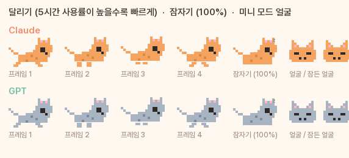

# AI Usage Widget 🐱

Claude Code / OpenAI Codex 사용량 한도(5시간·7일)를 화면에 **항상 떠 있는 작은 카드**로 보여주는 Windows 위젯입니다.
RunCat처럼 픽셀 고양이가 달리는데, 한도를 많이 쓸수록 빨리 달리고 100%가 되면 잠듭니다.


작업표시줄 미니 모드 (더블클릭으로 전환):


고양이 상태:



## 특징

- **Claude 5h / 7d, GPT(Codex) 5h / 7d** 도넛 게이지 + 리셋까지 남은 시간
- Claude의 **모델 전용 주간 한도**(예: Fable only)는 작은 막대로 표시
- **알림**: 80% 돌파, 100% 소진, 한도 리셋 시 카드 배너 + **위젯과 같은 디자인의 알림 팝업**(오른쪽 아래, 고양이 포함) + 알림음. Windows 알림 센터 토스트는 옵션 (각각 끌 수 있음)
- **페이스 예측**: 이 속도면 리셋 전에 부족한지 여유인지 (옵션)
- **전체화면 앱 감지 시 자동 숨김** (같은 모니터에서만), 종료되면 복귀
- **클릭 통과 모드**: 다른 창이 활성일 땐 마우스가 위젯을 통과, 바탕화면이 활성이거나 Ctrl을 누른 동안만 조작
- **작업표시줄 미니 모드**: 더블클릭하면 시계 왼쪽에 알약 모양(고양이 2마리 + 5h·7d %)으로 붙음. 좌우로 드래그해 자리를 정하면 기억. 다시 더블클릭하면 카드로 복귀
- **자동 업데이트**: 하루 한 번 GitHub 최신 릴리즈를 확인하고, 새 버전이면 팝업 → 클릭 한 번으로 내려받아 교체·재시작 (우클릭 메뉴에서 끄거나 즉시 확인 가능)
- 투명도 조절, 항상 위 토글, Windows 시작 시 자동 실행
- **적응형 폴링**: 사용률이 오르는 중이면 60초마다(⚡ 표시), 멈춰 있으면 3~5분마다, 조회 실패면 2배씩 물러남
- 조회 실패 시 마지막 값을 그대로 유지하되 10분 넘으면 "N분 전 값"으로 표시, 1시간 넘으면 회색 처리
- 카드 본체는 값이 바뀔 때만 다시 그려 CPU 사용 거의 없음 (~0.2%)

## 동작 원리

인증과 API 호출은 직접 하지 않고 [Win-CodexBar](https://github.com/nesszer/Win-CodexBar)의 CLI를 주기적으로(1~5분, 적응형) 실행해 JSON만 읽습니다.

```
codexbar-cli.exe usage -p both --json
```

그래서 토큰 갱신, 비공식 API 변경 대응은 Win-CodexBar가 맡고, 이 위젯은 그리기만 합니다.
Win-CodexBar 트레이 앱은 켜 둘 필요 없고, 설치만 되어 있으면 됩니다.

> 참고: ChatGPT 웹 채팅과 Gemini 채팅 한도는 조회 API가 없어 표시할 수 없습니다.
> Claude는 claude.ai 채팅과 Claude Code가 한도를 공유하므로 이 수치가 곧 전체 사용량입니다.

## 설치

전제: Windows 10/11, 그리고 이 PC에서 **Claude Code**(쓴다면 **Codex CLI**도)에 로그인되어 있을 것.
위젯은 그 로그인 정보를 읽어 한도를 조회합니다.

### 원클릭: `install.bat` 더블클릭

저장소를 내려받아(ZIP 또는 `git clone`) 폴더 안의 **`install.bat`** 을 더블클릭하면 아래를 자동으로 합니다.

1. Python이 없으면 winget으로 설치
2. Pillow 설치
3. Win-CodexBar가 없으면 winget으로 설치
4. 바탕화면에 "AI Usage Widget" 바로가기 생성 (더블클릭으로 켜고 끔)
5. Windows 시작 시 자동 실행 여부 질문 (Y/N)
6. 위젯 실행

끝나면 Win-CodexBar 설정 창이 열립니다. 사람이 직접 해야 하는 건 두 가지뿐입니다.

- 터미널에서 `claude`를 한 번 실행해 로그인 상태 확인
- Win-CodexBar 설정 → Providers → Claude → *Allow reading Claude Code's credentials* 체크 (이후 앱은 닫아도 됨)

### 수동 설치

1. **Python 3.11+** 설치 (python.org). 설치 화면에서 *Add python.exe to PATH* 체크. tkinter는 기본 포함.
2. **Pillow** 설치
   ```
   pip install pillow
   ```
3. **Win-CodexBar** 설치 후 한 번 실행해서 설정
   ```
   winget install Finesssee.Win-CodexBar
   ```
   트레이 아이콘 우클릭 → 설정 → Providers → Claude → *Allow reading Claude Code's credentials* 체크.
   이후 트레이 앱은 꺼도 됩니다 (CLI만 있으면 위젯이 동작).
4. 이 저장소를 내려받기 (`git clone` 또는 ZIP). 필요한 파일은 `usage_widget.py`, `toast.ps1`, `toggle_widget.bat`.
5. 실행
   ```
   pythonw usage_widget.py
   ```
   좌상단에 카드가 뜨면 성공. 첫 조회는 5~10초 걸립니다.
6. (선택) `toggle_widget.bat`의 바로가기를 바탕화면에 만들면 더블클릭으로 켜고 끌 수 있고,
   위젯 우클릭 → *Windows 시작 시 자동 실행*으로 부팅 시 자동으로 뜹니다.

### 문제 해결

| 증상 | 원인 / 해결 |
|---|---|
| "codexbar-cli.exe를 찾을 수 없습니다" | 3번 미설치 |
| Claude 자리가 "–", "조회 지연" | 3번의 자격증명 허용이 안 됐거나 Claude Code 미로그인. 터미널에서 `claude` 한 번 실행 |
| GPT 자리가 "–" | Codex CLI를 안 쓰면 정상. 우클릭 → *GPT(Codex) 표시* 체크 해제하면 Claude만 남고 카드가 절반 폭으로 줄어듦 |
| 글씨체가 다름 | Paperlogy, Pretendard 폰트가 없으면 맑은 고딕으로 대체. 같은 모양을 원하면 두 폰트 설치 |
| 위젯이 안 뜨는데 오류도 없음 | 폴더의 `widget.log` 확인 |

## 조작

| 동작 | 방법 |
|---|---|
| 이동 | 드래그 (위치 자동 저장) |
| 작업표시줄 미니 모드 전환 | 더블클릭 (또는 우클릭 메뉴) |
| 새로고침 / 종료 | 우상단 ↻ / ✕ |
| 옵션 | 우클릭 메뉴: GPT 표시 여부, 투명도, 페이스 예측, 클릭 통과, 알림 소리, 항상 위, 전체화면 시 숨김, 시작 시 자동 실행 |
| 클릭 통과 중 조작 | 바탕화면을 클릭해 활성화하거나 Ctrl을 누른 채로 |

## 커스터마이즈

`usage_widget.py` 상단의 상수만 바꾸면 됩니다.

- 색: `CARD`, `C_OK`, `C_WARN`, `C_BAD`, `PROVIDERS`의 강조색·고양이 색
- 크기: `W`, `H`, `GAUGE`, `CAT_PX`
- 조회 주기: `REFRESH_SEC` (60초 이하로 내리면 Anthropic 조회 API가 일시 차단할 수 있음)
- 고양이 모양: `CAT_BODY`, `CAT_LEGS` 도트 배열
- 폰트: `font()`가 Paperlogy → Pretendard → 맑은 고딕 순으로 찾음

디버그: 환경변수 `WIDGET_SNAP=경로.png`를 주면 렌더 결과를 파일로 저장합니다. 오류는 `widget.log`에 남습니다.

## 한계

- Win-CodexBar CLI의 JSON 형식에 의존합니다. 형식이 바뀌면 "조회 지연"만 계속 뜹니다.
- Anthropic / OpenAI의 비공식 조회 엔드포인트가 바뀌면 Win-CodexBar 업데이트를 기다려야 합니다.
- Windows 전용 (Win32 API 사용).

## 라이선스

MIT
