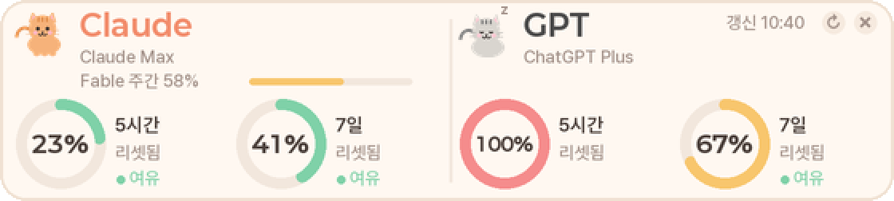
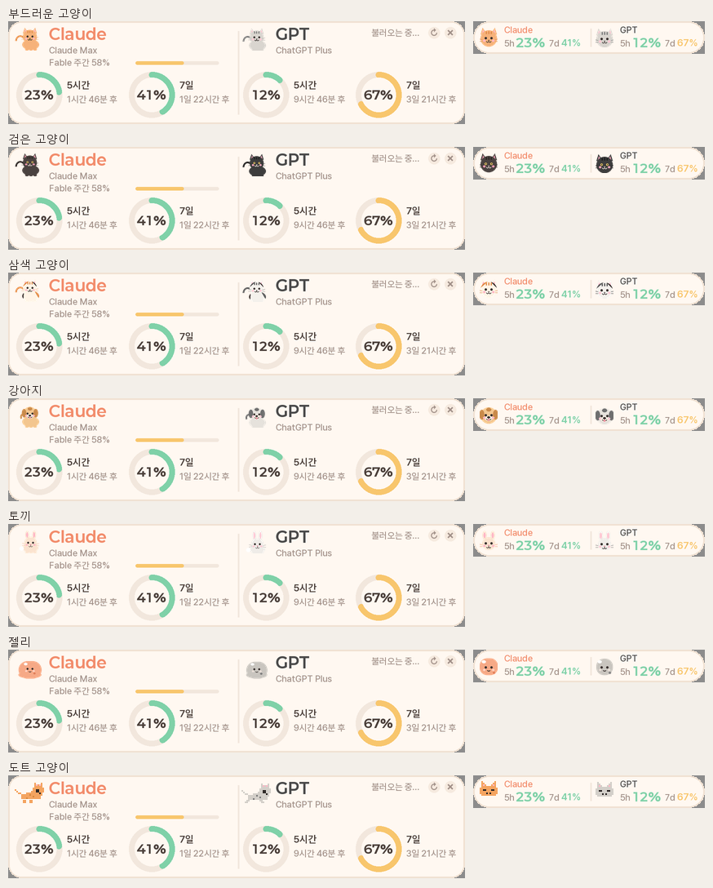

# AI Usage Widget 🐱

**Claude와 GPT를 얼마나 썼는지** 화면 한구석에 항상 떠 있는 작은 카드로 보여주는 Windows 위젯입니다.

- **보이는 것**: claude.ai 채팅 + Claude Code 사용량(둘이 한도를 공유), GPT의 Codex·ChatGPT Work 사용량
- **해당 없음**: ChatGPT 일반 채팅은 한도가 없어 셀 것이 없고, Gemini 채팅 한도는 조회할 방법이 공개되어 있지 않음
- Claude Code나 Codex를 **쓰지 않아도** 됩니다. 로그인만 해 두면 채팅 사용량이 보입니다.

작업표시줄 미니 모드 (더블클릭으로 전환):

캐릭터 스타일 (우클릭 메뉴에서 선택):

## 설치

1. [최신 릴리즈](https://github.com/jeonyounghyun/ai-usage-widget/releases/latest)에서 **`AIUsageWidget.exe`** 를 받습니다.
2. 받은 파일을 더블클릭합니다.
   - 파란색 "Windows의 PC 보호" 창이 뜨면 **추가 정보 → 실행**
   - 브라우저가 "흔하지 않은 파일"이라고 하면 **유지**
3. **설치 창**이 단계를 차례로 진행합니다. 직접 할 일은 버튼 몇 번뿐입니다.
   - **Claude 로그인**(필요할 때만): [로그인 시작] → 브라우저에서 로그인 → Authorize → 코드가 보이면 설치 창의 코드 칸에 붙여넣기
   - **"Codex나 ChatGPT Work를 쓰시나요?"** → 씁니다 / 채팅만 써요
   - **"Windows를 켤 때 자동으로 켤까요?"** → 켤게요 / 아니요
4. 화면 왼쪽 위에 카드가 뜨면 끝입니다. 받은 exe는 지워도 됩니다.

이미 된 단계는 건너뛰므로, 중간에 닫혔거나 회사 PC에서 설치가 막혔다면 나중에 받은 exe를 다시 실행하면 됩니다. 설치 창의 진행 기록은 설치 폴더의 `setup.log`에 남습니다.

설치 창이 함께 설치하는 것과 이유:

| 프로그램 | 이유 |
|---|---|
| Win-CodexBar | 사용량을 읽어 오는 도구 (트레이 앱은 켜 둘 필요 없음) |
| Claude Code | Claude 로그인 도구. 직접 쓸 일은 없고, claude.ai 채팅과 같은 한도를 씀 |
| Node.js + Codex CLI (GPT를 쓸 때만) | GPT 로그인 도구 |

Python은 필요 없습니다(exe에 들어 있음). 위젯은 `%LOCALAPPDATA%\Programs\ai-usage-widget\AIUsageWidget.exe` 한 파일로 설치되고, 위젯 우클릭 → 문제 해결 → **설치 폴더 열기**로 언제든 갈 수 있습니다.

### 나중에 GPT 연결하기 / 다시 로그인 / 설치 다시 하기

모두 위젯 우클릭 → **문제 해결** 메뉴에 있습니다. 우클릭 메뉴의 **GPT 표시**는 이미 연결된 GPT를 보이거나 숨기는 스위치일 뿐이라, 연결이 안 된 상태에서 켜면 "–"만 나옵니다.

### 제거

위젯 우클릭 → 문제 해결 → **위젯 제거**. 위젯, 바탕화면 바로가기, 자동 실행, (선택하면) 위젯 폴더를 지웁니다. 함께 설치된 Win-CodexBar·Claude Code·Node.js는 다른 용도로도 쓰일 수 있어 남겨 두며, 지우려면 Windows 설정 → 앱에서 각각 제거합니다.

### 예전 방식 (ZIP + install.bat)

v1.8.0 이전에 ZIP으로 설치한 PC는 그대로 동작하고 자동 업데이트도 됩니다. exe 방식으로 바꾸려면 `AIUsageWidget.exe`를 받아 실행하세요.

## 화면 읽는 법

마우스를 올리면 각 요소 설명이 뜹니다. 요약:

| 표시 | 뜻 |
|---|---|
| **5시간** 도넛 | 최근 5시간 동안 쓴 비율. 100%가 되면 표시된 시각에 0%로 리셋 |
| **7일** 도넛 | 최근 7일 동안 쓴 비율. 5시간 창과 별도 |
| 도넛 색 | 초록 50% 미만 · 노랑 50~80% · 빨강 80% 이상 |
| **Fable 주간** 막대 | Claude의 Fable 모델 전용 주간 한도. 7일 전체보다 먼저 차는 경우가 많음 |
| 도넛 아래 "N시간 후" | 리셋까지 남은 시간. "다음 사용 시 시작"은 새 창이 아직 열리지 않았다는 뜻 |
| 여유 / 빠듯 / 부족 예상 | (옵션) 지금 속도면 리셋 전에 한도가 남을지 |
| 우상단 "갱신 HH:MM" | 마지막 조회 시각. "· 1분 갱신"은 사용량이 오르는 중이라 자주 조회한다는 뜻 |
| "N분 전 값" (주황) | 10분 넘게 조회에 실패해 옛 값을 보여주는 중. 1시간 넘으면 회색 |
| "조회 실패 · 우클릭 → 문제 해결 → 점검" | 한 번도 값을 못 받음 → 우클릭 → 문제 해결 → 점검 실행 |
| "재로그인 필요 · 우클릭 → 문제 해결" | 로그인이 만료됨 → 우클릭 → 문제 해결 → Claude 다시 로그인 |
| 캐릭터 | 사용률이 빨리 오를수록 빨리 걷고(소진 속도), 10분간 변화 없으면 서서 쉬고, 30분이면 잠듦. 100%면 드러눕고, 리셋되면 기지개 |
| 도넛 안쪽 얇은 링 | 창(5시간·7일)의 시간이 얼마나 지났는지. 사용률 링보다 앞서 있으면 여유, 뒤처져 있으면 빠듯 |
| 미니 모드 색 점 | 이름 옆 점 = 5시간·7일 중 나쁜 쪽 색 |
| 미니 모드 "5h 23% · 7d 41%" | 5시간 · 7일 사용률 |

## 조작

| 동작 | 방법 |
|---|---|
| 이동 | 드래그 (위치 자동 저장) |
| 작업표시줄 미니 모드 | 더블클릭 (다시 더블클릭하면 카드로). 미니 상태에서 좌우 드래그로 자리 조정 |
| 켜기 / 다시 보이기 | 바탕화면 "AI 사용량 위젯" 더블클릭. 이미 켜져 있으면 끄지 않고 앞으로 불러옴 |
| 끄기 | 우클릭 → **종료 (위젯 끄기)**, 또는 우상단 ✕ |
| 새로고침 | 우상단 ↻ |
| 설정 / 문제 해결 | 우클릭 메뉴 |

우클릭 메뉴:

- **캐릭터 스타일**: 부드러운 고양이(기본) / 검은 고양이 / 삼색 고양이 / 강아지 / 토끼 / 젤리 / 도트 고양이 / 없음
- **Claude 표시 / GPT 표시**: 한쪽만 남길 수 있음 (카드가 절반 폭으로)
- **작업표시줄 미니 모드**
- **투명도**: 100 / 85 / 70 / 55%
- **테마**: 자동(Windows 다크 모드 따라감) / 밝게 / 어둡게
- **마우스를 올릴 때만 선명하게**: 평소엔 흐리게(45%) 두고 마우스를 올리면 설정한 투명도로
- **소진 예측 표시**: 도넛 아래에 여유/빠듯/부족 예상 표시
- **알림 (80% · 100% · 리셋)**: 화면 팝업(고양이 카드) / 소리(100% 소진·리셋 때만) / Windows 알림 센터. 80% 경고와 리셋 알림은 5시간 창만, 100% 소진은 5시간·7일 모두
- **클릭 통과 모드**: 다른 창이 활성일 땐 마우스가 위젯을 통과. 바탕화면을 클릭하거나 Ctrl을 누른 채로만 조작 가능. 켤 때 확인창이 뜸
- **항상 위에 표시**, **전체화면 앱 실행 시 숨김**(같은 모니터에서 영상·게임·발표 중 자동 숨김), **Windows 시작 시 자동 실행**
- **문제 해결**: 점검 실행 / Claude 다시 로그인 / GPT 연결하기 / 설치 폴더 열기 / 로그 열기 / 위젯 제거
- **새 버전 자동 확인** (하루 1회) / **지금 업데이트 확인**: 새 버전이면 팝업 → 클릭 → 확인 창 → 자동 교체·재시작

## 문제 해결

위젯이 켜져 있으면 **우클릭 → 문제 해결 → 점검 실행**, 아예 안 켜지면 설치 폴더의 `AIUsageWidget.exe`를 `--doctor`로 실행(예전 ZIP 설치본은 `doctor.bat`). 어디가 막혔는지와 해결 방법을 알려줍니다. 오류 원문은 영어로 나오지만 해결책은 한글이며, 아래 표는 그 요약입니다.

| 상황 | 해결 |
|---|---|
| GPT만 "토큰 갱신 중" / 점검에 "Authentication required" | GPT 접근 토큰이 10일마다 만료되는데 CodexBar가 갱신을 안 함. 위젯이 감지해 자동 갱신(1시간 내). Codex를 한 번 실행해도 됨 |
| 위젯에 "재로그인 필요" | 우클릭 → 문제 해결 → **Claude 다시 로그인** (브라우저 로그인 → Authorize → 완료 문구 확인) |
| 위젯에 "조회 실패" / Claude 자리 `–` | 우클릭 → 문제 해결 → **점검 실행**. 대부분 "사용량 읽기 허용 꺼짐"이거나 로그인 만료이며, 점검 결과에 더블클릭할 파일이 적혀 있음 |
| 점검 결과에 `rate limited` | 조회가 너무 잦아 잠시 막힘. 5~10분 뒤 저절로 풀림. 작업표시줄 시계 옆에 CodexBar 아이콘이 있으면 우클릭 → Quit |
| GPT 자리 `–` | GPT를 안 쓰면 정상 → 우클릭 → GPT 표시 해제. 보고 싶으면 문제 해결 → **GPT 연결하기** |
| Claude 로그인 방식을 물으면 | **"Claude account with subscription"**(구독 계정). 다른 방식은 한도가 없어 숫자가 안 뜸 |
| 위젯이 사라짐 | 바탕화면 "AI 사용량 위젯" 더블클릭 (앞으로 불러옴). 영상·게임 전체화면 중에는 자동으로 숨었다가 돌아옴 |
| 다운로드 폴더를 지웠는데 파일이 필요함 | 위젯 우클릭 → 문제 해결 → **설치 폴더 열기**. 위젯도 안 켜지면 `C:\Users\이름\AppData\Local\Programs\ai-usage-widget` |
| 설치가 막힘 (허용 창이 안 뜸, 10분 넘게 멈춤) | 창을 닫고 나중에 받은 exe를 다시 실행(된 단계는 건너뜀). 회사 PC면 IT 담당자에게 Win-CodexBar 설치 요청 |
| 그래도 안 됨 | 점검 화면을 캡처해서 설치해 준 사람에게 보여주기 |

### CodexBar 수동 설정 (설치해 주는 사람용)

위젯은 [Win-CodexBar](https://github.com/nesszer/Win-CodexBar)의 명령줄 도구로 사용량을 읽습니다. 설치 창이 설정을 자동으로 써 넣으며, CodexBar 업데이트로 초기화됐을 때도 위젯 우클릭 → 문제 해결 → 설치 다시 하기로 고쳐집니다. 손으로 해야 한다면:

1. 시작 메뉴에서 CodexBar 실행 → 작업표시줄 시계 옆 트레이 아이콘 우클릭 → **Settings**
2. 상단 **제공업체(Providers)** → **Claude** → **"Allow reading Claude Code's credentials"** 체크
3. 트레이 아이콘 우클릭 → **Quit**. 트레이 앱과 위젯이 동시에 조회하면 차단될 수 있어 위젯만 쓰는 편이 안정적입니다

## 동작 원리

- 위젯은 인증을 직접 하지 않습니다. Win-CodexBar의 `codexbar-cli.exe usage --source oauth`를 주기적으로 실행해 결과(JSON)만 읽습니다. 토큰 파일(`~/.claude/.credentials.json`, `~/.codex/auth.json`)만 읽고, 브라우저 쿠키나 `claude` 명령은 건드리지 않습니다.
- 조회 주기는 사용량이 오르는 중이면 1분, 멈춰 있으면 3~5분, 실패하면 2배씩 물러납니다. 부팅 자동 실행이면 첫 조회를 2분 늦춥니다.
- 카드는 값이 바뀔 때만 다시 그려 CPU를 거의 쓰지 않습니다.
- 하루 한 번 GitHub Releases를 확인해 새 버전이면 알려줍니다.

## 커스터마이즈

`usage_widget.py` 상단의 상수를 바꾸면 됩니다. 색(`CARD`, `C_OK`, `C_WARN`, `C_BAD`, `PROVIDERS_ALL`), 크기(`W`, `H`, `GAUGE`), 조회 주기(`REFRESH_*`), 고양이 도트(`CAT_BODY`, `CAT_LEGS`), 툴팁 문구(`TIPS`). 폰트는 Paperlogy → Pretendard → 맑은 고딕 순으로 찾습니다.

디버그: 환경변수 `WIDGET_SNAP=경로.png`로 렌더 결과 저장. 오류는 `widget.log`.

## 한계

- Win-CodexBar CLI의 출력 형식과 Anthropic·OpenAI의 비공식 조회 방식에 의존합니다. 바뀌면 Win-CodexBar 업데이트를 기다려야 합니다.
- Windows 전용.

## 라이선스

MIT
